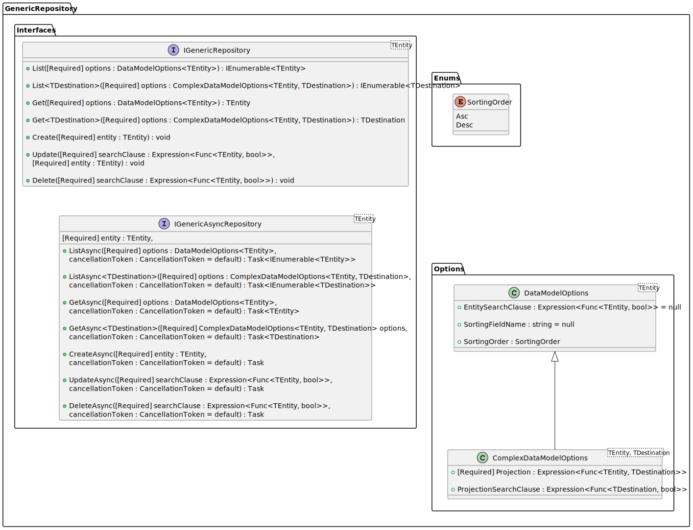

# GenericRepository.Contracts

Defines the necessary contracts for Generic Repository pattern implementation and takes into consideration 
that both synchronous and asynchronous versions of corresponding the service have to be implemented.

The General picture:

